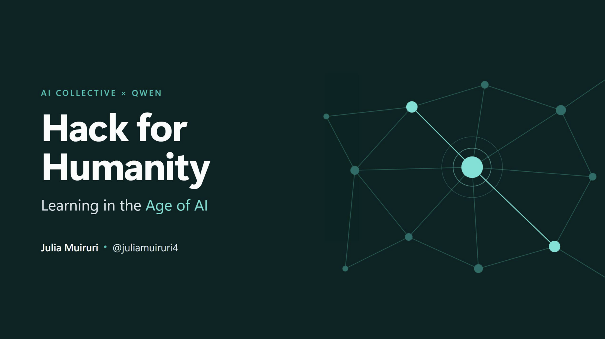
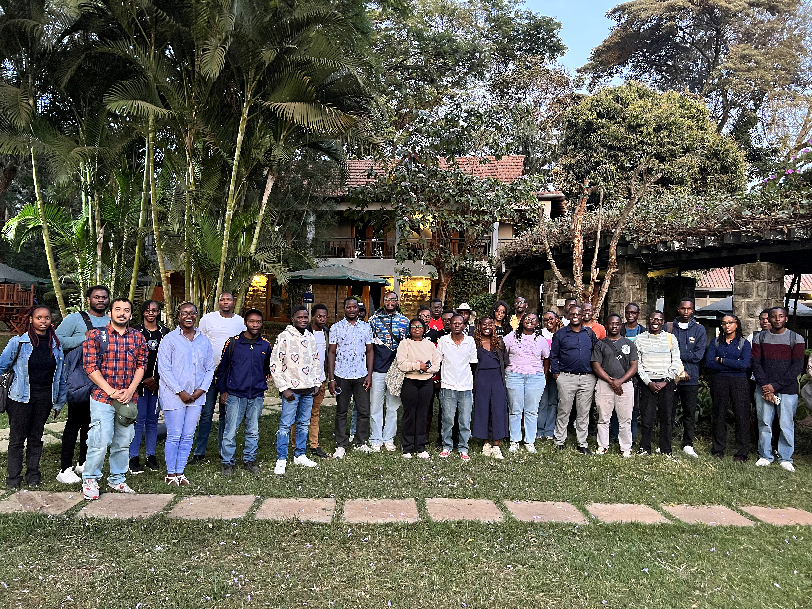
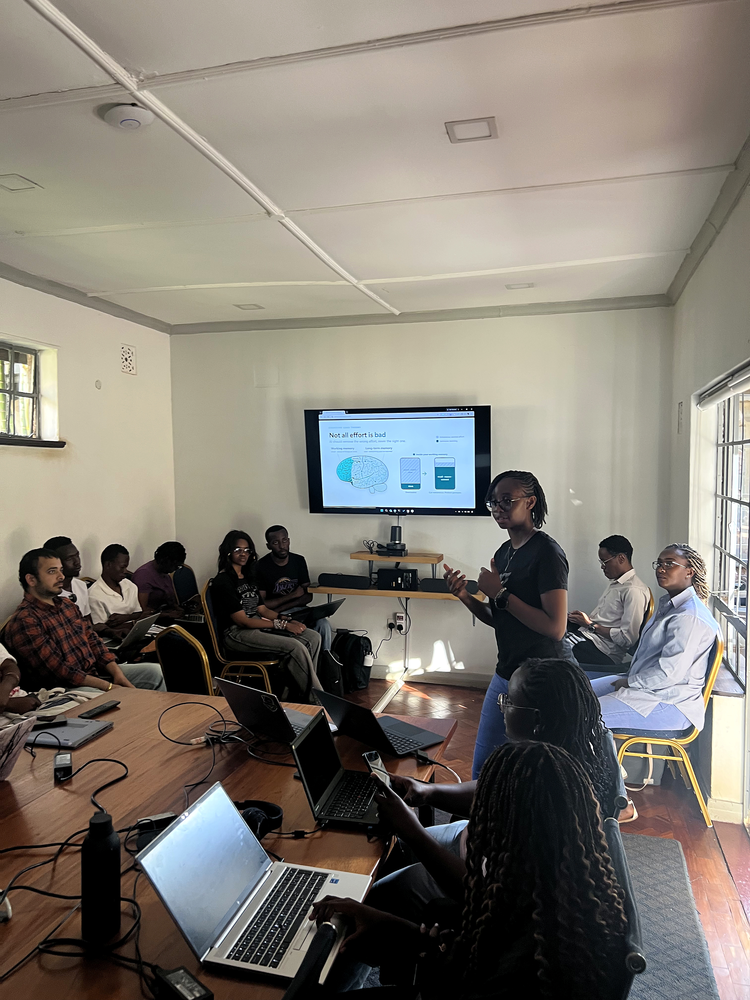

# Hack for Humanity: Learning in the Age of AI

- **Event:** AI Collective × Qwen Community event
- **Date:** September 26, 2026

AI can remove busywork, but learning still depends on reasoning, recalling, connecting, and focusing. This talk introduces StudySynk: a study tool built around one principle — **Cut extraneous load. Protect Germane load**. In other words, AI does the scaffolding; you do the thinking.

View or download the [PDF deck](Hack-for-Humanity.pdf).

|  |  |
| --- | --- |
|  |  |

## Resources

1. [Qwen](https://qwen.ai/)
2. [Using your own LLMs in GitHub Copilot CLI](https://docs.github.com/copilot/how-tos/copilot-cli/customize-copilot/use-byok-models)
3. [GitHub Copilot SDK](https://github.com/github/copilot-sdk)